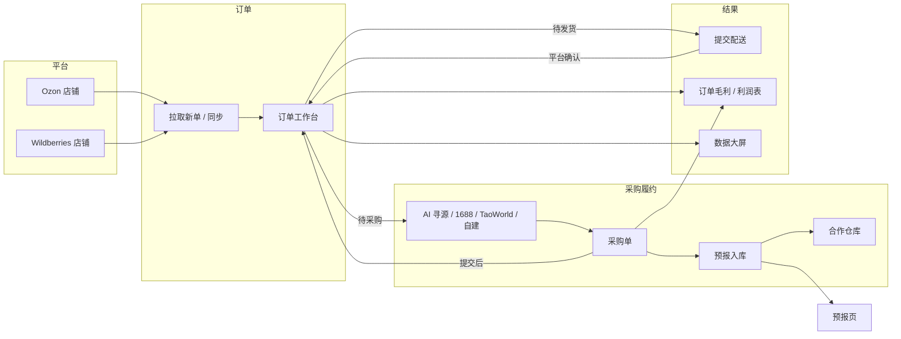
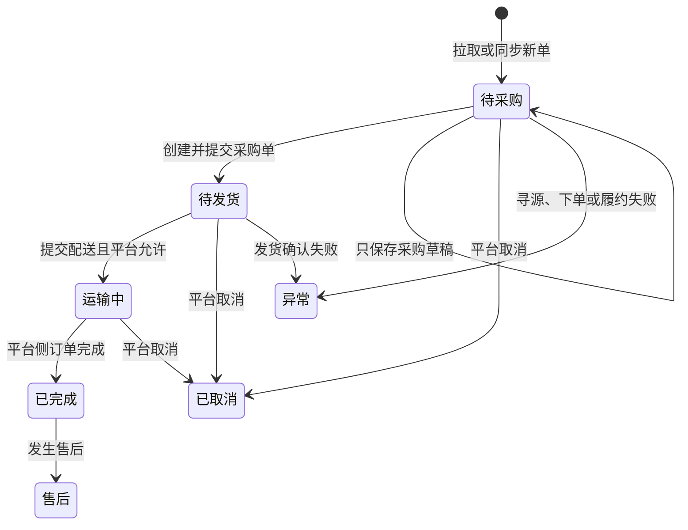
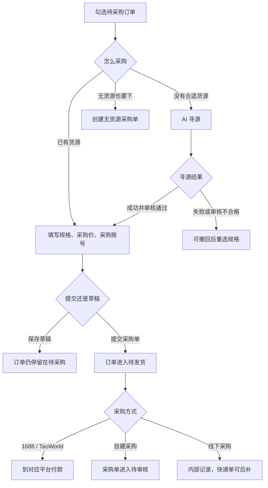
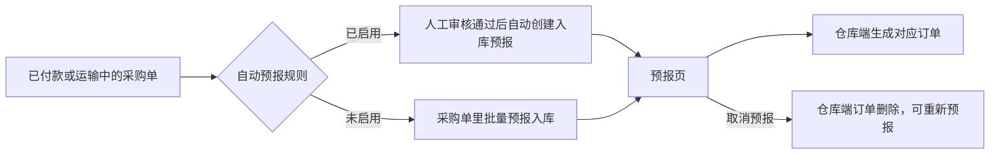
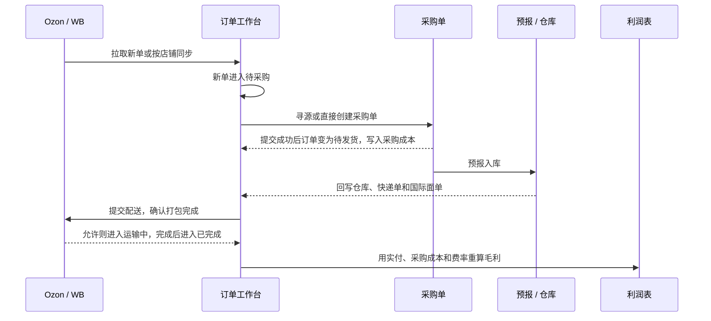

# 订单逻辑梳理

核对时间：2026-09-30  
系统：[如斯达 RusStar ERP](https://russtar.wildberries.center/#/orders/list)  
范围：左侧「订单」下的订单列表、采购单、预报页、利润表、数据大屏，以及它们和采购、仓库的衔接。

订单模块负责把 Ozon、Wildberries 上已经成交的订单接进 ERP，补上采购成本和履约信息，再算出利润。商品刊登不在这条链路里。

---

## 1. 模块怎么分工

| 菜单 | 地址 | 做什么 |
| --- | --- | --- |
| 订单列表 | `#/orders/list` | 订单工作台。拉单、分状态、建采购、提交配送、看利润 |
| 采购单 | `#/purchase/orders` | 采购订单中心。审核、付款、发货、预报入库 |
| 预报页 | `#/orders/preorder` | 采购单预报到仓库之后的预报记录 |
| 利润表 | `#/orders/statistics` | 按订单汇总销售额、采购、佣金和利润，可导出 |
| 数据大屏 | `#/orders/databoard` | 实时看订单量、销售额、热销店铺和爆款 |

旁边「采购」菜单里的供应商、货源管理、到货管理，给采购单提供货源和到货，不替代订单工作台。

这些旧地址会跳走，不再单独开页面：

- `#/orders/pending-purchase`、`pending-shipment`、`exception`、`after-sales`、`logistics`、`rules` 都回到订单列表，用顶部阶段筛选代替。
- `#/orders/workspace` 回到利润表。

---

## 2. 业务总图

主链路是：平台出单 → ERP 拉单 → 待采购 → 建采购单并进入待发货 → 预报仓库 → 提交配送后进入运输中 → 完成后计入利润。

---

## 3. 订单从哪里来

订单工作台右上角有两个入口：

- **拉取新单**：向已授权店铺要新订单。
- **同步**：按时间范围同步，可选近 1 天、近 3 天、近 7 天、近 30 天。必须先在筛选栏选好店铺，否则提示「请先在筛选栏选择店铺后再同步」。同步结果按成功、失败条数返回。

同步进来的一条订单至少带上：平台单号、店铺、商品标题、平台 SKU、平台商家编码、数量、平台实收、下单时间、履约仓、货物类型。商品标题可以后补同步；缺规格键时，详情里会提示重新同步订单。

列表可以按平台、店铺、履约仓、货物类型、下单起止日期，以及平台单号、SKU、商品标题筛选。货物类型包括小件货物、超尺寸货物、立体货物。

打印有两种：打印订单（导出 CSV）、打印面单。待采购订单平台还没生成面单，不能打印，系统会跳过这些单。导出可以导出勾选行，或导出当前筛选结果。

---

## 4. 订单状态怎么走

工作台用「订单处理阶段」把订单分成 8 段。操作列跟着状态变，不是每单都是同一个按钮。

| 阶段 | 列表上的主动作 | 业务含义 |
| --- | --- | --- |
| 待采购 | 采购 | 还没有有效采购单。采购成本显示为「—」，采购单列是「未建单」 |
| 待发货 | 提交配送 | 已经关联采购单。核对采购信息和成本之后，订单才进入这一段 |
| 运输中 | 查看为主 | 提交配送成功，并被标成「已发货 / 运输中」 |
| 已完成 | 查看 | 平台侧该订单已完成。已退款的订单不能再改毛利 |
| 已取消 | 查看 | 平台取消。汇总毛利时排除取消单 |
| 异常 | 查看并处理 | 寻源、下单、面单或发货确认失败 |
| 售后 | 查看 | 完成后的售后单 |

有些状态文案写明「该状态仅支持查看」。待发货详情里可以看关联采购单；待采购还没有这张单。

提交配送会向平台确认打包完成，并把 ERP 状态标成「已发货 / 运输中」。平台状态不允许时，只提示原因，不硬改。发货确认还可能卡在：商品数量不一致、找不到发货单、店铺凭据失效、平台要求先补商品信息。

---

## 5. 待采购怎么变成采购单

勾选待采购订单后，可以：

- **采购**：按订单商品建采购单，可多笔合并成一张。
- **AI寻源**：选已授权的 1688 采购账号，后台排队做图搜和规格匹配。没勾选时按钮不可用。寻源任务页可以离开，队列自己跑。
- **创建无货源采购单**：没有匹配货源时仍可建单。没勾选时不可用。
- **寻源任务**：查看已创建的批量寻源。

创建采购单时要逐行满足下单条件：采购规格、数量、采购价。同一组来源明细共用货源。买家留言默认是「请按下单规格发货」。

提交之后：

- 1688、TaoWorld：采购单提交到平台，提示到平台完成付款。
- 自建采购：状态是待审核，到采购单里审核。
- 保存草稿不改变订单状态。
- 提交成功后，订单从「待采购」变成「待发货」，并写上采购单号和采购成本。

采购订单中心把链路写成：订单需要采购 → 已建采购单 → 按采购方式执行。当前启用 1688 和自建采购；TaoWorld 出现在订单详情的采购方式里；三方平台和货盘分销还是预留，页面标成规划中。

采购单自己的阶段是：待付款、待供货 / 待发货、运输中、异常、已完成、退款 / 关闭。已付款或运输中的采购单才能批量预报。已预报的采购单不能再次上报。已终止、已完成的单不能再登记发货。订单如果在平台取消，要连带取消关联预报单。

---

## 6. 预报和仓库

采购单预报入库之后，记录落到预报页。预报页只展示结果：预报单号、来源订单号、预报仓库、预报状态、费用。

预报前要有合作仓库、仓库贴单价格，以及国内快递单号。1688 / TaoWorld 的快递单号可以先同步再预报。预报成功后，提示约三分钟后再做仓库操作，并去拉国际面单。

预报单可以改采购单价和预报备注，确认后同步到仓库端。取消预报会把仓库端对应订单删掉，之后可以重新预报。

订单详情里的仓库信息单独看履约库存：发货仓库、平台仓可用库存、本单占用、扣减后库存、库位。物流信息看物流渠道、国际面单号、货物类型、目的国家和物流状态。面单状态分待生成、已生成、拉取失败。

---

## 7. 利润怎么算

工作台顶部 6 张卡片，统计的是当前筛选里的非取消订单，金额折成人民币。

| 卡片 | 口径 |
| --- | --- |
| 订单量 | 非取消订单数，并标出已核算、待补成本各多少单 |
| 订单收入 | 非取消订单实付合计，同时给平均客单价 |
| 采购成本 | 订单匹配到的采购单成本，并显示占收入比例 |
| 平台及履约费用 | 佣金、税费、运费等 |
| 总成本 | 采购成本加上平台及履约费用 |
| 预计毛利 | 收入减总成本。待补成本的订单不进毛利，避免把毛利算高 |

单行「预计利润」可以悬停看利润明细。还没匹配采购单时，成本按 0，利润率会显示成 100%，工作台会把这些单标成待补成本。

订单详情「订单毛利」是逐单核算：

- 订单金额：平台实收换算成 CNY。
- 平台佣金、提现费、广告费、税费：按订单金额乘费率，费率可改。Wildberries 佣金可以单独「拉取 WB 佣金」。
- 采购成本：从关联采购单同步，不能手改。
- 包装成本、运费、自定义费用：可以改。
- 退款金额：从订单退款同步，不能手改。当前利润模型里退款多数还没落库。
- 改完费用或费率会实时重算，保存后写回订单列表的利润列。已退款订单不能再编辑。

销售利润率看利润占订单收入的比例，成本利润率看利润占成本的比例。列表、详情和利润表用同一套公式。

---

## 8. 利润表和数据大屏

利润表筛选和订单列表对齐，也可以把订单列表当前筛选同步过来。它按已完成订单看有效销售额，并列出订单原始金额、预估回款、已回款、采购金额、佣金成本、物流成本、退款、其他成本和利润。卡片金额统一折成人民币，订单行仍保留原币种。明细可以导出。同步记录按所选店铺记成功和失败。

数据大屏是只读总览：全部订单或今日、近 7 日，可按店铺筛选。展示订单量、销售额、GMV 走势、热销店铺 TOP10、爆款产品 TOP10、实时订单和订单数趋势。它不改订单状态。

---

## 9. 一条订单的完整路径

对应到页面上的判断：

1. 采购单列是「未建单」、操作是「采购」：订单还在待采购。
2. 采购单列已有 PO 号、操作是「提交配送」：采购已提交，等向平台确认发货。
3. 国际面单是「待生成」：仓库或平台面单还没回来，待采购阶段也不能打印面单。
4. 利润是 100% 且成本为 0：多半还没匹配采购成本，工作台会把它算进待补成本，不把它当成真实毛利。
